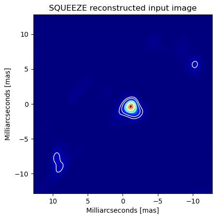
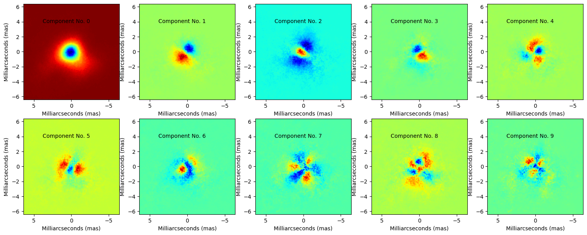
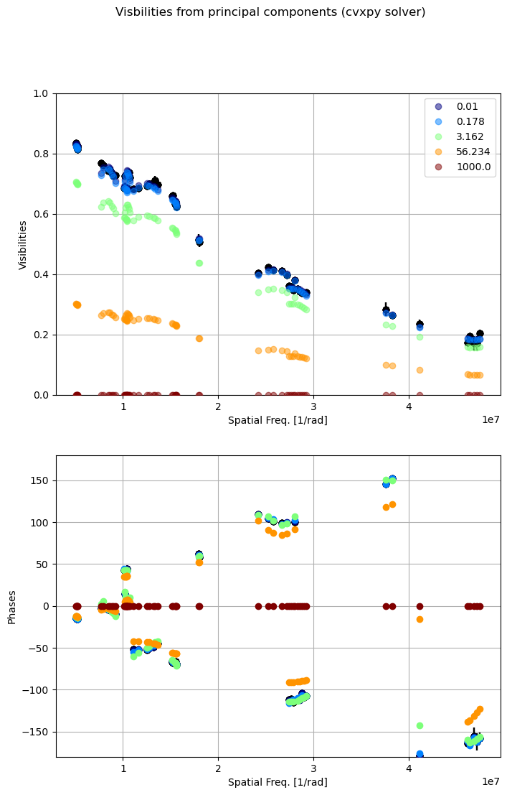
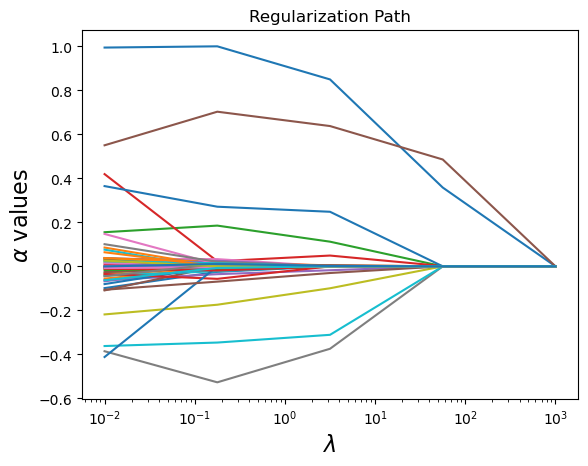
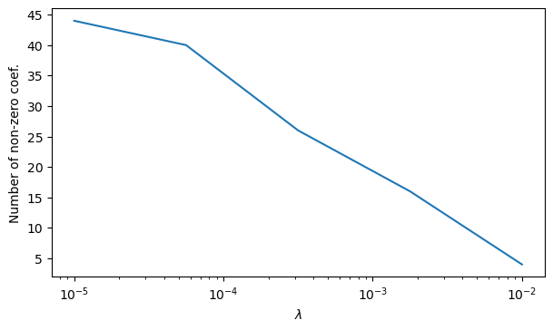

# This repository includes software to perform Principal Component Analysis for infrared interferometric imaging based on Compressed Sensing (CASSINI/PCA V1.0)


## 1 Principal Component Analysis


Principal Component Analysis, or PCA, is a dimensionality-reduction method, which transform a large set of variables into a smaller one that still contains most of the information in the large set. In this repository, we include a series of scripts to perform PCA on recovered infrared interferometric images. These images could be obtained with [<strong>CASSINI/LASSO</strong>](about.md) or with any other image reconstruction software (e.g., [BSMEM](https://www.astro.phy.cam.ac.uk/research/ResearchFacilities/software-for-astrophyiscs/bsmem), [SQUEEZE](https://github.com/fabienbaron/squeeze) or [MiRA](https://cral-perso.univ-lyon1.fr/labo/perso/eric.thiebaut/?Software/MiRA)). The purpose of applying PCA to interferometric images is to evaluate the quality of the reconstructions in terms of the features observed in the image. Very recently [Medeiros et al. (2020)](https://arxiv.org/pdf/1804.05903.pdf) has demonstrated that PCA is a potential technique to characterize variability in reconstructed images from sparse interferometric data. 

Those authors demonstrated that the Fourier transforms of eigenimages derived from PCA applied to an ensemble of images in the spatial-domain are identical to the eigenvectors of PCA applied to the ensemble of the Fourier transforms of the images. This means that the visibilities of interferometric data can be represented as a linear combination of the Fourier transform of the principal components of the reconstructed images. 


## 2 Visibilities from PCA
<p align="justify">
Here, we included some tools to perform this kind of analysis. As example on the usability of the code, we include reconstructed images from data obtained with GRAVITY/VLTI data using SQUEEZE. The cube of images is included together with the code in the <strong>CASSINI/PCA</strong> directory. The data cube consists in 307 reconstruced images (513 x 513 pixels) of a compact young stellar object. Figure 1 shows the mean image out of the 307 frames in the cube. It can be appreciated that the image shows a central elongated object. Also, two secondary lobes, due to the sparsity of the u-v plane, are observed in the image.  
</p>


<figure markdown> 
  { width="400" height="400"}
  <figcaption>Fig 1. Mean reconstructed image of the source used for PCA analysis. </figcaption>
</figure>

The code uses the following input parameters: 

``` py

#######  The tolowing parameters are necessary to run CASSINI/PCA ##################
cube_filename = 'cube_example.fits' ## The data cube with the reconstructed images
oifits_filename = 'oifits_example.fits' ## The oifits file with the interferometric data to be modeled

### For fitting 1 #####
n_comp = 50 ###Number of components to be extracted from the image, it has to be less or equal than the number of frames in the cube
scale = 0.1 ### Pixel scale used in the reconstruction of the images (mas)
n_comp_compiled = 10 ## Number of components to be added and stored into a .fits file for visualization purposes (it has to be <= n_comp)
display = True ## Bolean variable, it is used to display a plot of the 10 principal components in the image (in n_comp has to be equal or larger than 10)
#lambd_values = [0.01]
lambd_values1 = np.logspace(-2, 3, 5)
```

<mark>PCA_im.py</mark> computes number of principal components defined with <mark>n_comp</mark>. The variable <mark>n_comp_compiled</mark> defines the number of principal components to be used to recover the visibilities through a minimization based on compressed sensing. The <mark>n_comp_compiled</mark> value has to be equal or lower to the total number of principal components computed by the code.  In case <mark>display=True</mark> the code wil produce a plot of the initial 10 components (see Figure 2). <strong>NOTE: The number of extracted components should be larger or equal than 10. Otherwise, the code will complain/crash!.</strong> 


<figure markdown> 
  { width="800" height="350"}
  <figcaption>Fig 2. Panels with the 10 different components produced by the data in the example included with the code. </figcaption>
</figure>

The <mark>lambd_values1</mark> parameter correspond to the hyperparameter values used for the compressed sensing computation of the visibilities from the dictionary of structures extracted from the Principal Components of the image cube. <mark>lambd_values1</mark> could take a float or an array of values. 
By default, the code will solve the compressed sensing problem using the Python package [cvxpy](https://www.cvxpy.org). However, the code allows the user to use other two Python packages, [sklearn.decomposition](https://scikit-learn.org/stable/modules/classes.html#module-sklearn.linear_model) and [PyLops](https://pylops.readthedocs.io/en/latest/), to solve the Compressed Sensing reconstruction of the vislibilities. In order to enable these options, the user has to declare as True the following two boolean variables:

``` py
sklearn_opt = True
lambd_values2 = np.logspace(-2, 3, 5) ##Lambda values for CS solver using scikit-learn
pylops_opt = True
lambd_values3 = np.logspace(-2, 3, 5) ##Lambda values for CS solver using pylops
```
Notice that the <mark>lambd_values2</mark> and <mark>lambd_values3</mark> should be declared as float or array. Notice that these values could be similar to <mark>lambd_values1</mark>. However, they could produce different results. This is because the different Python solvers use different methods for finding the eigenvalues (&alpha;). Nevertheless, the purpose of using different solvers is that the user could have the possibility to check how these results affect the reconstruction based on the morphological properties of the source in the image. 

Each compressed sensing solver produces a cube of images stored in <strong>.fits</strong> files. A <strong>.fits</strong> file is produced for each hyperparameter used. Each <strong>.fits</strong> cube contains with the principal components from the image weighted by their corresponding eigenvalues to recover the visibility values. The user can use these cube of images to evaluate he controbution of the different components to the final recovered structure of the target. For each compressed sensing solve, the code produces a plot with the reconstruction of the visibilities and phases from the number of components defined in <mark>n_comp_compiled</mark> for each one of the hyperparameter value used. Figure 3 shows an example of this plot, similar plots are also produced if the other two solvers are enabled.  


<figure markdown> 
  { width="500" height="800"}
  <figcaption>Fig 3. Visibilities recovered from the principal components of the cube of reconstructed images. The visibility amplitudes (upper panel) and the phases (lower panel) are reovered using a compressed sensing solver of the Fourier Transform of the principal components at the u-v frequencies traced with the inteferometer. The compressed sensins solver uses the number of components defined in <mark>n_comp_compiled</mark>. The different colors in the plot indicates the visibility extractions using different hyperparameter (λ) values. </figcaption>
</figure>

For the default <mark>cvxpy</mark> solver, the code also produces an image that traces the regularization path of the different sparse eigenvalues for which each principal component image is multiplied. Notice that for an extreme case, where the hyperparameter λ over-regularizes the data, the eigenvalues beta decay to zero (see Figure 4).    

<figure markdown> 
  { width="550" height="400"}
  <figcaption>Fig 4. Visibilities recovered from the principal components of the cube of reconstructed images. The visibility amplitudes (upper panel) and the phases (lower panel) are reovered using a compressed sensing solver of the Fourier Transform of the principal components at the u-v frequencies traced with the inteferometer. The compressed sensins solver uses the number of components defined in <mark>n_comp_compiled</mark>. The different colors in the plot indicates the visibility extractions using different hyperparameter (λ) values. </figcaption>
</figure>

For the <mark>sklearn</mark> solver, the code also produces an image that displays the number of non-zero coefficients in the &alpha; values for the different hyperameter  (λ) values used in the reconstruction (see Figure 5). 

<figure markdown> 
  { width="550" height="400"}
  <figcaption>Fig 5. Number of non-zero &alpha; coefficients for each visibility reconstruction for a given hyperparameter </figcaption>
</figure>

<strong>NOTE: The code delivered here is still under construction. Please use it with caution. Future improvements include more in-depth analysis of the plots and images generated by CASSINI/PCA. </strong>
