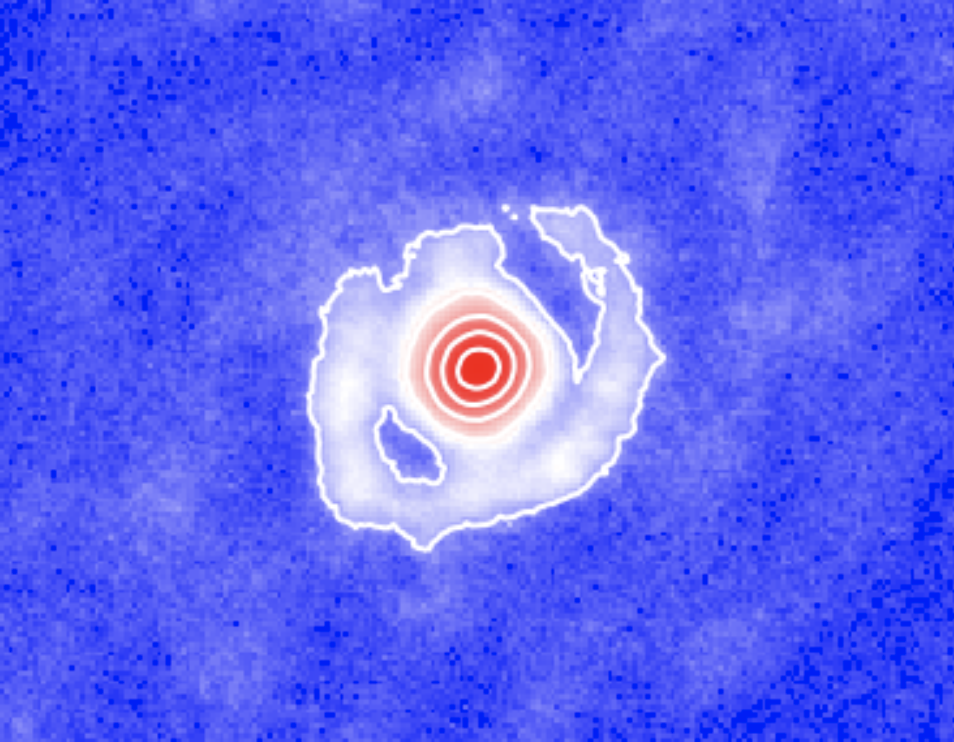

# Welcome to CASSINI - A project to develop image reconstruction tools based con Compressed sensing an Neural Networks 

<p align="center">
  
</p>

## The project 
<p align="justify">
Interferometry delivers the highest angular resolution in Astronomy. Since the 1960s, it is being used extensively in radio astronomy and, since about a couple of decades, it has become an important player in infrared astronomy. However, infrared interferometry is restricted to sparse arrays of only a few telescopes. While imaging is arguably the most intuitive way to analyze interferometric data, recovering images from sparsely sampled visibilities is challenging. 
</p>

<p align="justify">
<strong>Which is the impact of the sparse u-v coverage on imaging?</strong>
The sparse u-v coverage obtained with infrared arrays requieres complementary “a-priori” information to recover an image. From signal theory, interferometric imaging is an “ill-possed” problem, even monochromatic images as small as 128x128 pixels requiere at least 16384 visibilities to obtain an independent solution. This number of data points is virtually imposible to obtain, given the current number of telescopes that forms infrared arrays. For example, the Very Large Telescope Interferometer (VLTI) can only provide up to 6 visibility points (per wavelength) per snapshot. Therefore, typically, there are more unknowns (or pixel values) than equations (u-v data) to solve the imaging problem. This constraint on the number of visibility points could be relaxed, if we consider that the pixels in astronomical images are not independent because we are observing highly structured morphologies. We can take advantage of the compressibility of the brightness distribution in the Fourier space and, hence, to use considerably less number of visibility points for retrieving an image. However, we would still require assumptions on the target’s morphology to achieve a reliable imaging solution. 
</p>

<p align="justify">
<strong>How does the lack of full-phase information influence imaging?</strong>
At infrared wavelengths, the atmosphere plays an important role for interferometric observations. The millisecond coherence time and the photon starved regime of the observations make virtually imposible to retrieve reliable Fourier phases as interferometric observables. In contrast with radio observations, the argument of the bispectrum (often called closure phases) of the visibilities is used for retrieving information on the centro-symmetric asymmetries of the source. One of the most important limitation of this observable is that it is shift-invariable to the position of the source in the pixel grid. This means that the image of a source could be formed at any position in the pixel grid and the resultant closure phases will be the same. This implies that, while relative astrometry is retrieved, the absolute astrometry of the imaged object lost. The limited phase information does not allow us to use direct Fourier inversion techniques (such as CLEAN) to recover images. In contrast, regularized minimization algorithms over the pixel values are required. 
</p>

<p align="justify">
<strong>This project aims at investigating new algorithms for interferometric image reconstruction based on the theory of Compressed Sensing and the novel implementation of compressibility of a signal trhough  Neural Networks to retrieve more reliable interferometric images from sparse arrays.</strong>
</p>


## Project layout

    CASSINI # The main directory of the project
    SAMPip/ # This directory contains the software to perform data
	# reduction of Aperture Masking Data. It also contains JWST SAM data
	# on WR137 to run the example illustrated in this documentation
	NN_imaging/ # This directory contains the software to perform
    # image reconstruction using a Convotutional Neural Network called AUTOMAP
    RCAR_analysis/ # This directory contains the software
    # and tools used for analyzing GRAVITY-VLTI data of the AGB star R Car
    CS_SAM/ # This directory contains the software tools to perform
	# interferometric imaging based on Compressed Sensing 
    CS_PCA/ # This directory contains the software to obtain the
	# principal components of images and their corresponding Fourier
	# transforms.  
    
## Installation 

There is no need for specific installation of the code. Each sub-package is self-contained. To use each one of them, it is as simple as clone the main repository folder with the following command: 

``` bash
>> git clone https://github.com/cosmosz5/CASSINI.git
```

However, each sub-package made use of the different Python modules available in the community. It is necessary that the user install them separately. Below, there is a description of the different requirements for each sub-module:

## Requirements 
(all the CASSINI codes work with Python 3.x)


### Python modules for CASSINI/SAMPip

The main module to run the code is ` test.py `. This script defines the input parameters and invoke the necesary code to run SAMPip. The user can modify this script to adapt it to his/her necessities. The user can run it on the Terminal by typing: 

``` bash
>> python test.py
```

Required packages:

``` bash
numpy
astropy
cvxpy
sklearn
skimage
pylops
```

` test.py` finishes in debug mode. To get out of it, the user should type "q" in the Terminal.

### Python modules for CASSINI/NN_imaging

The main module to run the code is
` AUTOMAP_keras_4.py `. This script run the Convolutional
Neural Network for imaging. The user can modify this script to adapt
it to his/her necessities. The user can run it on the Terminal (to
start the trainning process) by typing: 

``` bash
>> python python AUTOMAP_keras_4.py --mode train --epochs 300 --batch-size 128

```

Required packages:

``` bash
plaidml
keras
astropy
numpy
argparse
math
oitools
```


### Python modules for CASSINI/RCAR_analysis

This module include all the tools developed to analyze parametric
models and reconstructed images for the analysis of the morphology of
AGB stars. This module includes a `Python jupyter notebook `  called
` RCar_analysis.ipynb ` to run
all the examples included in the repository. 

Required packages installed:

``` bash
astropy
emcee
lmfit
matplotlib
numpy
Open CV
scipy
sklearn
```

### Python modules for CASSINI/CS_SAM

The main module to run the code is ` CS_JWST_v1.py `. This script defines the input parameters and invoke the necesary code to run the compressed sensins imaging. To run the code on <strong>CASSINI/LASSO</strong> it is necessary to have the DATABASE of ring models for the dictionary to work. A part of this database is included in the repository. However, due to space resctictions on GitHub, the complete version of the DATABASE can be found in the this [link](https://www.dropbox.com/sh/mtadpwbpns6nsvf/AABYHEQiMpuWPGvMvLqVLACVa?dl=0). The user can modify this script to adapt it to his/her necessities. The user can run it on the Terminal by typing: 

``` bash
>> python CS_JWST_v1.py
``` 

Required packages installed:

``` bash
numpy
astropy
matplotlib
pylab
sklearn
```
` CS_JWST_v1.py ` finishes in a debug mode. To get out of it, the user should type "q" in the terminal


### Python modules for CASSINI/CS_PCA

This module contains tools to extract the Principal Components of a
reconstructed image and of its Fourier transform. The main module to
run the code is ` PCA_im.py `. The user can modify this script to
adapt it to his/her necessities (see also [CASSINI-GRAVITY RCAR
analysis](RCAR.md) for an additional example on how to use CASSINI-PCA). The user can run it on the Terminal by typing: 

``` bash
>> python PCA_im.py
``` 

Required packages:

``` bash
cvxpy
sklearn
PyLops
numpy
```

# DISCLAIMER

This project has been developed with funding from the UNAM PAPIIT
project IA 101220 and from the Mexico's National Council of
Humanities, Science and Technology (CONACyT) “Ciencia de Frontera” project 263975. All the scripts that compose CASSINI are open source under GNU License. For enquiries and/or contributions please  contact <mailto:joelsb@astro.unam.mx>

